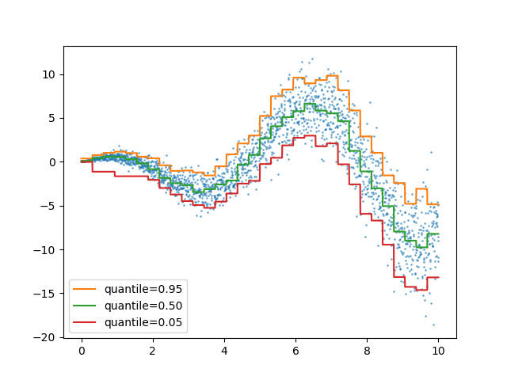

<mdConfig columns=2 padding="20mm" fontSize="9pt" hyphens="auto" textAlign="justify" fontFamily="'CMU Serif', Georgia, serif" CornellSpace="0mm"></mdConfig>


# markdownpaper
Use markdown syntax to create beautiful documentations, scientific scripts or papers, through a single static HTML file without runtime dependencies or build processes.

There is no need for NPM, Ruby, Python, Perl Environment, Docker container, Java runtime, online services or subscription. It runs anywhere without any installation and creates a print ready HTML layout.

> Write content, focus on content. Layout ain't your problem.


<TableOfContents>
## Content
</TableOfContents>


<mdColumnBreak></mdColumnBreak>

## Introduction
This tool has no relation of dependency to LaTex and does not attempt to be feature complete to LaTex, all content is handeled by JavScript and rendered by your browser only.

Academic and printing documents require some specific features like a table of contents or caption you can refer to. These and more features are supported an extended syntax which is covered by this document.

Do not expect that any markdown content is rendered correctly. The focus is on academic and printing content. Rendering elements that are larger than a single page are not supported (e.g. large code sections). There are other tools to checkout for converting markdown into presentable HTML like [MkDocs](https://www.mkdocs.org/).

<div>

### Content source
There are four approaches to render markdown content:
1. Open the `index.html` locally and drag & drop your markdown file to render.
1. Host the `index.html` as static Website with a markdown file on the webserver. The default path is `./contend.md`.
1. Host the `index.html` as static Website and call it with the parameter `?content=path/to/markdown.md`.
1. Embed markdown content directly into `index.html` by editing the first script tag with the id `mdContent` and removing the `src` attribute.

The root path of any media defined in the markdown is the location of the `index.html`. The actual location of the content is NOT respected. Make sure that all resources, like images, use the root path of the `index.html`.

Loading the markdown content automatically works only if the `index.html` is hosted, because the browser blocks fetching from local file paths.

The default loading path for a hosted service can be changed by editing the `src` attribute in the first script tag with the id `mdContent`.

*IMHO:* My setup is [VSCode](https://code.visualstudio.com/) with the extension [Live Preview](https://marketplace.visualstudio.com/items?itemName=ms-vscode.live-server). This will host the `index.html` locally without headache and enables a live preview of the content.

</div>


<div>

### Recommnded setup
Use [VSCode](https://code.visualstudio.com/) with the extension [Live Preview](https://marketplace.visualstudio.com/items?itemName=ms-vscode.live-server) or [Live Server](https://marketplace.visualstudio.com/items?itemName=ritwickdey.LiveServer).

Create a directory and place a `index.html` next to the `index.html`. VSCode has syntax highlighting support for markdown and you can watch with the 'Live preview' your rendered content.

</div>


<div>

### Printing
Recommended printing are:
- **Layout:** Portrait
- **Format:** A4
- **Margins:** None
- **Scale:** Standard

The main purpose of this tool is to create a PDF through the browsers print option. Thus all pages are exactly shaped as A4 in portrait orientation. This trick and the browser printing have some limitations that cannot be avoided, because JavaScript is not allowed to modify printing options.

If there is the need of another paper size like A5, the sizes has to be edited in the embedded style sheets of the `index.html`. When printing the document, the custom page size should also be set in the printing options again, this can be done automatically as well as enabling printing background images and colors!

When printing, any padding of the page should be removed. The printing border is already handled by the page layout, allowing for individual configuration.

</div>


<mdColumnBreak></mdColumnBreak>

## Writing markdown
The library marked.js[mdMarked] is used for parsing and compiling markdown. Thus almost all common markdown syntax is supported, details about supported elements can be read here: <https://marked.js.org/#specifications>. The following sections show the appearance of standard markdown elements.

<div>


### Headings
Headlines are automatically enumerated by their level, with `#` for *H1*, `##` for *H2*, and so on. The heading `#` *H1* is treated special because it defines the title of the document and its's content, it is not enumerated and will not appear in the table of contents.

```markdown
# Heading 1

## Heading 2
### Heading 3
#### Heading 4
##### Heading 5
###### Heading 6
```
---

<div style="margin: 0; font-size: 3.0rem; font-weight: bold;">Heading 1</div>
<div style="margin: 0; font-size: 1.8rem; font-weight: bold;">1. Heading 2</div>
<div style="margin: 0; font-size: 1.5rem; font-weight: bold;">1. 1. Heading 3</div>
<div style="margin: 0; font-size: 1.3rem; font-weight: bold;">1. 1. 1. Heading 4</div>
<div style="margin: 0; font-size: 1.1rem; font-weight: bold;">1. 1. 1. 1. Heading 5</div>
<div style="margin: 0; font-size: 1.0rem; font-weight: bold;">1. 1. 1. 1. 1. Heading 6</div>

</div>


<div>

### Paragraphs
Paragraphs are separated by a blank line. The text will be wrapped automatically. Do not indent your text, otherwise it is interpreted as a code block. The text align and hyphen policy can be set by the configuration, which is mentioned later.

```
Lorem ipsum dolor sit amet, consetetur sadipscing elitr, sed diam nonumy eirmod tempor invidunt ut labore et dolore magna aliquyam erat.

At vero eos et accusam et justo duo dolores et ea rebum. Stet clita kasd gubergren, no sea takimata sanctus est Lorem ipsum dolor sit amet.
```
---

Lorem ipsum dolor sit amet, consetetur sadipscing elitr, sed diam nonumy eirmod tempor invidunt ut labore et dolore magna aliquyam erat.

At vero eos et accusam et justo duo dolores et ea rebum. Stet clita kasd gubergren, no sea takimata sanctus est Lorem ipsum dolor sit amet.

</div>


<div>

### Lists
Lists can be created using the `-`, `*` or `1.` characters for unordered lists, and numbers followed by a period for ordered lists. Nested lists are supported as well and can be created by indenting the sub list items.

```markdown
- Item
- Item
    1. Sub
    1. Sub
- Item

1. Item
1. Item
    - Sub
    - Sub
1. Item
```
---

- Item
- Item
    1. Sub
    1. Sub
- Item

1. Item
1. Item
    - Sub
    - Sub
1. Item

</div>


<div>

### Images
Embedd images by the standard markdown syntax of `` or by using the `` HTML syntax. All examples result in the same output.

The aspect ratio of images is always respected and are scaled to 100% column width. The root of relative paths is set to the location of the `index.html`.

```markdown
[img]: ./media/sailboat.bmp
![img]


```
---


</div>


<div>

### Links
Links are created either markdown syntax or HTML tags. Both will be rendered as clickable hyperlinks. They are always rendered italic, and without text or color decoration. The configured text align does not apply to link content.

```markdown
[Markdown Guide](https://www.markdownguide.org/)

<https://github.com/Wasserwecken/markdownpaper>

<a href="https://daringfireball.net/projects/markdown/">Markdown Project</a>
```
---

[Markdown Guide](https://www.markdownguide.org/)

<a href="https://daringfireball.net/projects/markdown/">Markdown Source</a>

<https://github.com/Wasserwecken/markdownpaper>

</div>


<div>

### Quotes
Quotes are created using the `>` character at the beginning of a line. The configured text align does not apply to link content.

```markdown
> "The only limit to our realization of tomorrow will be our doubts of today." - Franklin D. Roosevelt
```
---

> "The only limit to our realization of tomorrow will be our doubts of today." - Franklin D. Roosevelt

</div>


<div>

### Code
Code blocks are created using triple backticks (```) or by indenting lines with four spaces. They will be rendered in a monospaced font with a gray background. Enable syntax highlighting by setting the language after the begining ticks.

~~~python
```python
def helloWorld():
    print("Hello World")
```
~~~
---
```python
def helloWorld():
    print("Hello World")
```

</div>


<div>

### Tables
Tables can be created using pipes (`|`) and hyphens (`-`). They will be rendered as HTML tables.

```markdown
| Tables   |      Are      |  Cool |
|----------|:-------------:|------:|
| col 1 |  left-aligned | $1600 |
| col 2 |    centered   |   $12 |
| col 3 | right-aligned |    $1 |
| Lorem | Lorem ipsum dolor sit amet, consetetur sadipscing elitr, sed diam nonumy eirmod tempor invidunt ut labore et dolore magna aliquyam erat, sed diam voluptua. At vero eos et accusam et justo duo dolores et ea rebum. | ipsum |
```
---

| Tables   |      Are      |  Cool |
|----------|:-------------:|------:|
| col 1 |  left-aligned | $1600 |
| col 2 |    centered   |   $12 |
| col 3 | right-aligned |    $1 |
| Lorem | Lorem ipsum dolor sit amet, consetetur sadipscing elitr, sed diam nonumy eirmod tempor invidunt ut labore et dolore magna aliquyam erat, sed diam voluptua. At vero eos et accusam et justo duo dolores et ea rebum. | ipsum |

</div>


<ColumnBreak></ColumnBreak>

## Markdown Extensions
There are several tags and behaviours to extend the markdown definitions. These extensions are the key of writing serious documents with proper citations, captions or table of contents.


<div>

### Math formulas
Math formulas are supported by using the `$` syntax for inline formulas and `$$` for block formulas. This is enabled by the MathJax[mathjax] library to render formulas and the syntax is very simillar to LaTeX. Notherless there are some limitation, which can be read at their documentation, as well as the basic usage here: <https://docs.mathjax.org/en/latest/>.

```markdown
This is a line holding a nested formular, $a^2 * b^2 = c^2$, to show of the inlining.

$$\pi^* = v_{\pi^*}(s) = \max_{a \in A} \sum_{s',r} p(s',r|s,a) [r+\gamma v(s')]$$
```
---
This is a line holding, $a^2 * b^2 = c^2$, a nested formular to show of the inlining.

$$\pi^* = v_{\pi^*}(s) = \max_{a \in A} \sum_{s',r} p(s',r|s,a) [r+\gamma v(s')]$$

</div>


<div>

### Header & Footer
A global annotation for all pages, visible the very top and bottom of each page, can be defined anywhere with a `<mdHeader>` and `<mdFooter>` tag. You can define them multiple times, but only the content of the very last will be used.

```markdown
<mdHeader>
This here defines the header content for all pages.
</mdHeader>

<mdFooter>
This here defines the footer content for all pages.
</mdFooter>
```
---
<mdHeader>
This here defines the header content for all pages.
</mdHeader>

<mdFooter>
This here defines the footer content for all pages.
</mdFooter>

Look at the top and bottom of each page to for the result.

</div>


<div>

### Grouping
Elements can be grouped together to avoid a split across columns. Group elements together by using the `<div>` tag and placing any content inside the `<div>` tag.

Content MUST not indented at all, and there must be an empty line before and after the `<div>` tag to be recognized correctly.

```markdown
<div>

## Heading in a div
This is my important content.

</div>

```
---
All sections in this document are grouped together, this resulting in some odd columns distriburtions.

</div>


<div>

### Citations
Defined citation data with the `<mdCitation>` tag and place all information inside. Citation can be defined anywhere in the document because they are not rendered inplace. There are no rules how to define the content of the citation, just write as your standard requires you to do it.

To use the defined citation in your content use the markdown bracket syntax `[myCitationId]` anywhere. The id is replaced during rendering with a link and the enumeration of the citation. This should match the [IEEE](https://pitt.libguides.com/citationhelp/ieee) standard.

If there is the need for having a specific text instead of the automatic enumeration, use the `key`-attribute to define the final link text.

Use the tag `<mdCitations>` (plural) to render a list of all defined citations in the document. The citation list is rendered at the position where the tag is defined, allowing for any position in the document. Any content defined in the citation list tag is rendered first, all citations are added afterwards.

```markdown
<mdCitation id="citMarkdownpaper" key="okay">
*markdownpaper*,
Eric Dolch,
*Display markdown into paper style HTML site*,
2025,
https://github.com/Wasserwecken/markdownpaper
</mdCitation>

<mdCitation id="citMathjax">
*MathJax*,
MathJax Team,
*Beautiful and accessible math in all browsers*,
2025,
https://www.mathjax.org/
</mdCitation>

<mdCitation id="citMarked">
*Marked.js*
Christopher Jeffrey, Josh Bruce, Steven, Jamie Davis, Tony Brix, Trevor Buckner
*A markdown parser and compiler. Built for speed*,
2025,
https://marked.js.org/
</mdCitation>

Lets refer to a citation here[citMarkdownpaper] and to a double one there[citMathjax][citMarked].

<mdCitations>
## [!]References
</mdCitations>
```
---
<mdCitation id="citMarkdownpaper" key="okay">
*markdownpaper*,
Eric Dolch,
*Display markdown into paper style HTML site*,
2025,
https://github.com/Wasserwecken/markdownpaper
</mdCitation>

<mdCitation id="citMathjax">
*MathJax*,
MathJax Team,
*Beautiful and accessible math in all browsers*,
2025,
https://www.mathjax.org/
</mdCitation>

<mdCitation id="citMarked">
*Marked.js*
Christopher Jeffrey, Josh Bruce, Steven, Jamie Davis, Tony Brix, Trevor Buckner
*A markdown parser and compiler. Built for speed*,
2025,
https://marked.js.org/
</mdCitation>

Lets refer to a citation here[citMarkdownpaper] and to a double one there[citMathjax][citMarked].

<mdCitations>
<div style="margin: 0; font-size: 1.8rem; font-weight: bold;">References</div>
</mdCitations>

</div>


<div>

### Footnotes
Use the tag `<mdFootnote>` to add small numbered notes with additional information at the bottom of a page. The tag can be defined anywhere and be reused. Place the content of your footnote inside the tag without indentation.

To use the defined footnote in your content use the markdown bracket syntax `[myFootnoteId]` anywhere. The id is replaced during rendering with a link and the enumeration of the citation.

If there is the need for having a specific text instead of the automatic enumeration, use the `key`-attribute to define the final link text.

```markdown
<mdFootnote id="fotLine" key="†">
In geometry, a **straight** line, usually abbreviated line, is an infinitely long object with no width, depth, or curvature, an idealization of such physical objects as a straightedge, a taut string, or a ray of light.
</mdFootnote>

<mdFootnote id="fotAdd">
Adjective. Britannica Dictionary definition: More than is usual or expected.
</mdFootnote>

This line[fotLine] has an annotation to some additional[fotLine] information.
```
---
<mdFootnote id="fotLine" key="†">
In geometry, a **straight** line, usually abbreviated line, is an infinitely long object with no width, depth, or curvature, an idealization of such physical objects as a straightedge, a taut string, or a ray of light.
</mdFootnote>

<mdFootnote id="fotAdd">
Adjective. Britannica Dictionary definition: More than is usual or expected.
</mdFootnote>

This line[fotLine] has an annotation to some additional[fotLine] information.

</div>


</div>

### References & Sublines
Images, formulars, quotes and tables often need additional context or a label to refer from the paragraphs. Use the `<ref>` tag to define citations, references or footnotes.

The tag requires to attributes to be set:
- **id** - Used to create internal references by using brackets.
- **type** - Determines the behaviour and label for the reference.


<div>

#### Footnotes
To add small numbered notes with additional information at the bottom of a page. Set the `type` attribute to `footnote` and place the information inside the tag anywhere in your document. The tag is not rendered inplace, but will be rendered at the bottom of the page where the reference is refered to.

```
<Ref id="myFoot" type="footnote">
In geometry, a **straight** line, usually abbreviated line, is an infinitely long object with no width, depth, or curvature, an idealization of such physical objects as a straightedge, a taut string, or a ray of light.
</Ref>

This line[myFoot] has an annotation to some additional information.
```
---
<mdFootnote id="myFoot" key="*">
In geometry, a **straight** line, usually abbreviated line, is an infinitely long object with no width, depth, or curvature, an idealization of such physical objects as a straightedge, a taut string, or a ray of light.
</mdFootnote>

This line[myFoot] has a annotation to some additional information.

</div>


<div>

#### Citations
Citations give credit to the original authors of ideas and information, help readers verify information and explore sources further. Set the `type` attribute to `citation` and place the information inside the tag anywhere in your document. The tag is not rendered inplace, but will be added to the reference list.

Use the tag `<References>` to render the list of citations where you need to show them. All content inside the reference list tag will be rendered first and all citations are then listed below.

```
<Ref id="markdown" type="citation">
*Markdown syntax*,
John Gruber,
*Markdown is a text-to-HTML conversion tool for web writers.*,
2004,
https://daringfireball.net/projects/markdown/
</Ref>

<References>
## References
</References>
```
---

<mdCitation id="citMarkdownpaper">
*markdownpaper*,
Eric Dolch,
*Display markdown into paper style HTML site*,
2025,
https://github.com/Wasserwecken/markdownpaper
</mdCitation>

<mdCitation id="citMathjax">
*MathJax*,
MathJax Team,
*Beautiful and accessible math in all browsers*,
2025,
https://www.mathjax.org/
</mdCitation>

<mdCitation id="citMarked">
*Marked.js*
Christopher Jeffrey, Josh Bruce, Steven, Jamie Davis, Tony Brix, Trevor Buckner
*A markdown parser and compiler. Built for speed*,
2025,
https://marked.js.org/
</mdCitation>

<mdCitations>
## References
</mdCitations>

</div>


<div>

#### Sublines
The `<ref>` is also used to annotate and label any element in the document. The element placed before the `ref` tag is then used as target for the annotation. Any element like lists, figures or tables can be labeled this way. Set the `type` attribute to anything else than `footnote` or `citation`, the given type name is then used as label for the subline and will be enumerated.

```
> "This is my personal Quote, may stating something important!"

<ref id="myQuote" type="quote">
This is an important addition to the quote.
</ref>


<ref id="myFig" type="figure">
I did not expect using Lorem Ipsum that much after I knew about it.
</ref>

This paragraph can now refer to the quote[myQuote] by using the quote id and also to the [myFig] showing off the linking.
```
---
> "This is my personal Quote, may stating something important!"

<mdCaption id="myQuote" type="quote">
An addition to the quote would not improve the conclusion.
</mdCaption>



<mdCaption id="myFig" type="figure">
There is a wobbly line in the figure to express something important.
</mdCaption>

</div>


<div>

### Layout configuration
The general look and feel of the renderer can be adjusted with ease by using the `<Config>` tag. Several attributes are supported:
- **Columns**: Defines the columns per page as integer. Recommended is 2 or 1.
- **Padding**: Defines the print border of each page. Any CSS value can be used like '2rem' or '1.5cm'.
- **Hyphens**: Specifies how words should be hyphenated when text wraps across multiple lines. [Use any valid CSS hyphens value](https://developer.mozilla.org/en-US/docs/Web/CSS/hyphens).
- **TextAlign**: Sets the horizontal alignment of the inline-level content. [Use any valid CSS text-align value](https://developer.mozilla.org/en-US/docs/Web/CSS/text-align).
- **FontFamily**: Specifies a prioritized list of one or more font family names and/or generic family names. [Use any valid CSS font-family value](https://developer.mozilla.org/en-US/docs/Web/CSS/font-family).
- **FontSize**: Sets the base size of the font, headings and other special elements are in relation to this size. [Use any valid CSS font-size value](https://developer.mozilla.org/en-US/docs/Web/CSS/font-size).
- **CornellSize**: Defines an extra right padding of the content, providing space for custom notes by the reader. This is also known as the 'cornell method'. Any CSS size value is accepted.


```

<Config columns=2 padding="16mm" fontSize="9pt" hyphens="auto" textAlign="justify" fontFamily="'Linux Libertine O', math, Georgia, serif" CornellSize="0mm"></Config>

```
---
The look and feel of this document is equivalent to the shown config.

</div>


<div>

### Column & Page break
Sometimes it is required to control the flow and content seperation by column or page breaks. Us the tags `<PageBreak>` or `<ColumnBreak>` to force a new page or column for the following content.

If the layout specifies only a single column for each page, tjhe behaviour of `<ColumnBreak>` is equivalent to `<PageBreak>`.

The `<PageBreak>` does not only force a new page, but can also later the look and feel for all following pages, enabling for alternating styles within a single document. All attributes of `<Config>` are supported.

```
<ColumnBreak></ColumnBreak>

<PageBreak Columns=1></PageBreak>
```


</div>


<div>

### Table of contents
To render a table of contents, place the `<TableOfContents>` tag anywhere it is desired. Only enumerated headings of h2 or lower are included. Any markdown content provided within the tag is placed before any content list item.

```
<TableOfContents>
## Content
</TableOfContents>
```
---
The table of contents at the beginning of this document is renderd by the shown example.

</div>


### Column span
asdasdad

```
<ColumnSpan>
<drawio src="./media/graph.drawio"></drawio>
</ColumnSpan>
```
---

<ColumnSpan>
<mdDiagram src="./media/graph.drawio"></drawio>
</ColumnSpan>


<div>

### Diagrams
Diagrams from `https://app.diagrams.net/` can be embedded directly into the document with the `drawio` tag.

The diagram data can be provided either via an URL that can be set as `src` attribute in the tag. If this attribute is not defined, the content of the tag is expected to hold the diagram data.

```
<drawio src="./media/graph.drawio"></drawio>

```
---
<mdDiagram src="./media/graph.drawio"></drawio>

</div>


<div>

### Complex content
Because markdown is converted to HTML elements, any HTML structure can be embedded into the markdown. Almost any content style can be created this way.

```
<div style="position: relative; height: 16rem;">
    <div style="background-color: white; position: absolute; transform: rotate(-15deg);">
        <iframe src="https://www.example.com" style="border: 5px dashed #1C6EA4; overflow: hidden; height: 14rem;"></iframe>
    </div>
</div>
```
---
<div style="position: relative; height: 16rem;">
    <div style="background-color: white; position: absolute; transform: rotate(-15deg);">
        <iframe src="https://www.example.com" style="border: 5px dashed #1C6EA4; overflow: hidden; height: 14rem;"></iframe>
    </div>
</div>

</div>
